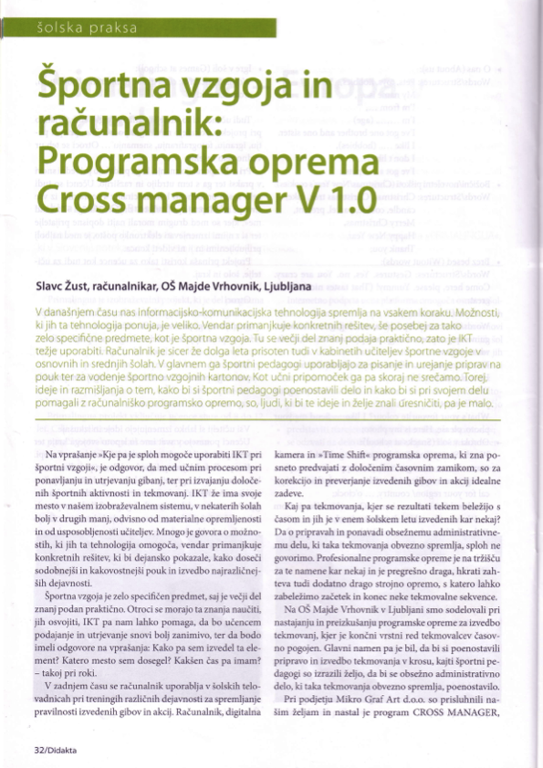
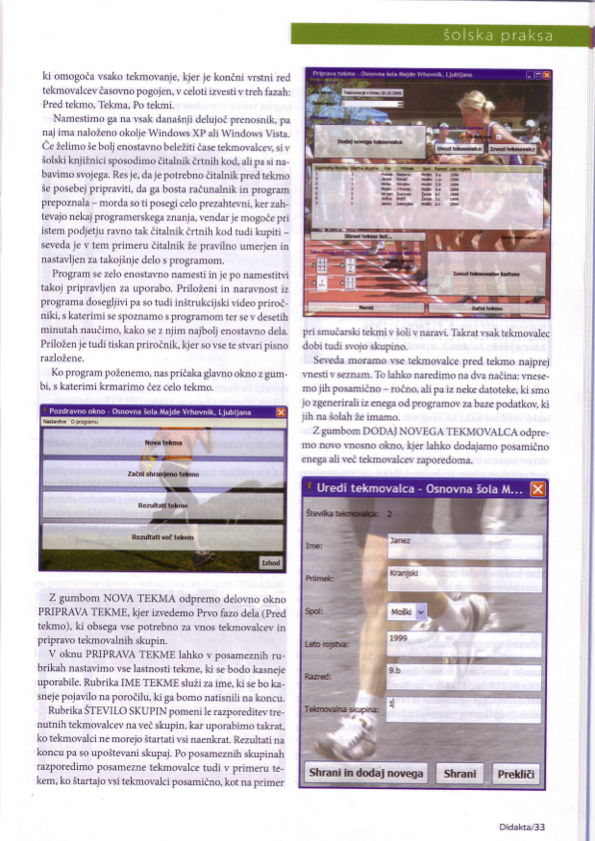
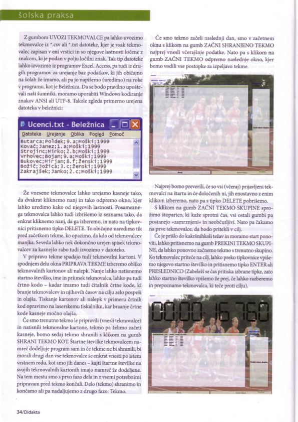
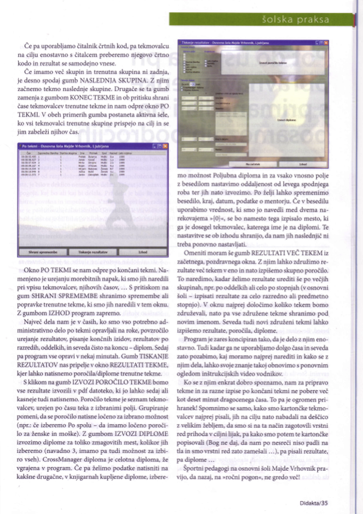

# CrossManager 1.0

I have implemented the CrossManager 1.0 suite to ease organization of school cross matches in 2008. I collaborated with primary school computer class teacher Slavc Žust, who also wrote an article about the program and evaluated the program in the Slovenian Didakta journal:

This repository contains full source code. Usage videos are available in folder `autobuilder_by_SISW_FINAL/publish_cd/02_Pomoc`.